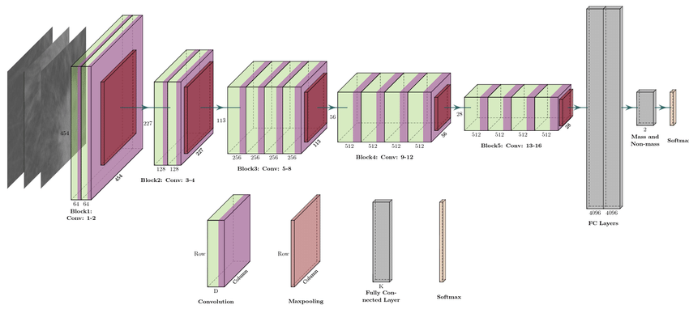
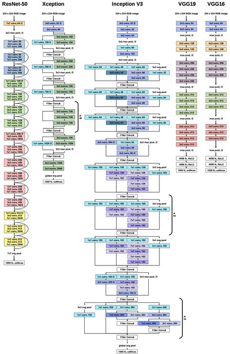

# Malaria_detection
Used deep learning model to predict the images as infected or uninfected 
After trying all the models i chose vgg19 for better accuracy. 
I also build a CNN model from scratch but it was unable to give more accuracy than other transfer learning technique. 
resnet50 is also giving less accuracy as compared to vgg19. 
vgg19 architecture is as follows - 

Detailed architecture of vgg19 along with other great models.

## Detailed Project Documentation

# Malaria Detection using Deep Learning (VGG19 Transfer Learning)

## Project Goal
This project aims to detect malaria from images of blood cells by classifying them as either "Infected" or "Uninfected" using a deep learning approach.

## Methodology

### Transfer Learning
The project utilizes transfer learning, a technique where a model pre-trained on a very large dataset (ImageNet in this case) is repurposed for a new, related task. This allows the model to leverage general features learned from millions of diverse images, which is especially beneficial when the target dataset is smaller.

### VGG19 Model
The chosen deep learning architecture is VGG19, a convolutional neural network (CNN) known for its depth and consistent use of 3x3 convolutional filters. It was selected over custom CNNs and ResNet50 due to its superior accuracy for this specific task.

## Code Walkthrough (from malaria_detection.ipynb)

### 1. Setup and Imports
- The notebook was developed in Google Colab, indicated by drive mounting commands.
- Key libraries imported include:
  - `tensorflow.keras`: For building, training, and running deep learning models (layers, pre-trained models like VGG19, image preprocessing utilities).
  - `numpy`: For numerical operations and data manipulation.
  - `matplotlib`: For plotting graphs (e.g., loss and accuracy curves).
  - `glob`: For finding files matching specific patterns.

### 2. Data Preparation
- **Image Size**: All input images are uniformly resized to 224x224 pixels, which is the required input dimension for the VGG19 model.
- **Data Paths**: Variables `train_path` and `valid_path` specify the locations of the training and validation datasets. These paths are expected to contain subfolders (e.g., 'Parasite', 'Uninfected') which are used for automatic class labeling.
- **Data Augmentation using `ImageDataGenerator`**:
  - **Rescaling**: Pixel values of images are normalized to a range of 0 to 1 (by dividing by 255).
  - **Augmentation for Training Data**: The training set undergoes various transformations like `shear_range = 0.2` (random shearing), `zoom_range = 0.2` (random zooming), and `horizontal_flip = True` (random horizontal flipping). These augmentations increase the diversity of the training data, helping the model generalize better and reducing overfitting.
  - `flow_from_directory`: This function creates data generators (`training_set`, `test_set`) that efficiently load images from directories, apply preprocessing/augmentation, and assign categorical labels based on the folder names.

### 3. Model Building (Transfer Learning with VGG19)
- **VGG19 Base Model Initialization**:
  - `VGG19(input_shape=IMAGE_SIZE + [3], weights='imagenet', include_top=False)`: Loads the VGG19 model.
    - `input_shape=IMAGE_SIZE + [3]`: Specifies input shape for 224x224 pixel RGB images.
    - `weights='imagenet'`: Uses weights pre-trained on the ImageNet dataset.
    - `include_top=False`: Removes VGG19's original fully connected classification layers, allowing for customization for this specific task.
- **Freezing Layers**:
  - `for layer in vgg.layers: layer.trainable = False`: The layers of the pre-trained VGG19 model are set to be non-trainable. This means their weights will not be updated during the training process, preserving the powerful feature representations learned from ImageNet.
- **Custom Classification Head**:
  - **Output Classes**: The number of output classes (Infected/Uninfected) is determined by counting subfolders in the training directory.
  - **Flatten Layer**: The 3D output of the VGG19 convolutional base is flattened into a 1D vector (`Flatten()`).
  - **Dense Output Layer**: A new fully connected layer (`Dense`) is added. It has neurons equal to the number of classes and uses a `softmax` activation function, which outputs probabilities for each class.
- **Final Model Construction**: The VGG19 base and the new classification head are combined using `Model(inputs=vgg.input, outputs=prediction)` to form the complete deep learning model.
- **Model Summary**: `model.summary()` displays the architecture, output shapes, and the number of trainable and non-trainable parameters. This clearly shows that only the newly added dense layer is trainable.

### 4. Model Compilation
- The model is configured for training:
  - `loss='categorical_crossentropy'`: The loss function used for training, appropriate for multi-class classification.
  - `optimizer='adam'`: An adaptive optimization algorithm that efficiently adjusts model weights.
  - `metrics=['accuracy']`: The performance of the model is monitored using classification accuracy.

### 5. Model Training
- **Model Checkpoint**: A `ModelCheckpoint` callback is used to save the model weights only when the validation accuracy improves during training. This ensures that the best performing model is retained.
- **Training Execution**: The `model.fit_generator()` method (or `model.fit()` in newer Keras) trains the model using the prepared `training_set` and validates its performance on the `test_set` over 50 epochs.

### 6. Evaluation and Prediction
- **Loss and Accuracy Plots**: The training history (loss and accuracy for both training and validation sets) is plotted to visually assess the model's learning progress and identify potential overfitting.
- **Batch Prediction**: The model predicts probabilities for all images in the `test_set`. `np.argmax` is used to convert these probabilities into definitive class predictions (0 or 1).
- **Single Image Prediction**: The notebook demonstrates how to load, preprocess, and make a prediction for a single new image. The prediction result (Infected or Uninfected) is then printed based on the output class with the highest probability.

## Conclusion
This deep learning project successfully implements a malaria detection system using VGG19 with transfer learning, demonstrating a practical application of CNNs for image classification in a medical context.